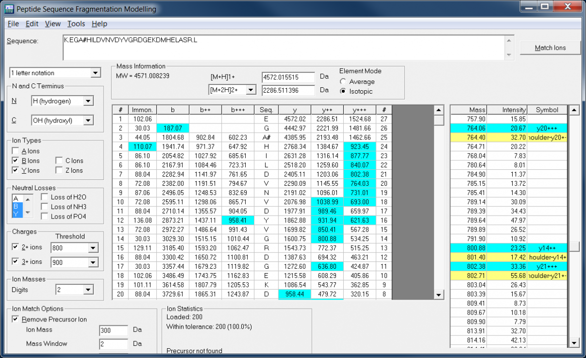

# __Molecular Weight Calculator__
Calculates the molecular weight and percent composition of chemical formulas and amino acids.

### Description
This program can calculate the molecular weight and percent composition of chemical formulas and amino acids, providing a graphical user interface to edit the formulas and parsing options. It recognizes user-definable abbreviations, custom elemental isotopes, and can display up to 20 compounds simultaneously. It also includes a Mole/Mass Converter, Formula Finder, Capillary Flow Modeler, Amino Acid Notation Converter, Peptide Sequence Fragmentation Modeler, and built-in calculator.

See also the [.NET DLL version](https://pnnl-comp-mass-spec.github.io/Molecular-Weight-Calculator-DLL/) of the Molecular Weight Calculator

### Downloads
* [Latest version](https://github.com/PNNL-Comp-Mass-Spec/Molecular-Weight-Calculator-VB6/releases/latest)
* [Source code on GitHub](https://github.com/PNNL-Comp-Mass-Spec/Molecular-Weight-Calculator-VB6)

#### Software Instructions
The desktop version of the Molecular Weight Calculator is written in VB6.  It successfully runs on Windows XP, Windows 7, and Windows 8.

### Acknowledgment

All publications that utilize this software should provide appropriate acknowledgement to PNNL and the Molecular-Weight-Calculator-VB6 GitHub repository. However, if the software is extended or modified, then any subsequent publications should include a more extensive statement, as shown in the Readme file for the given application or on the website that more fully describes the application.

### Disclaimer

These programs are primarily designed to run on Windows machines. Please use them at your own risk. This material was prepared as an account of work sponsored by an agency of the United States Government. Neither the United States Government nor the United States Department of Energy, nor Battelle, nor any of their employees, makes any warranty, express or implied, or assumes any legal liability or responsibility for the accuracy, completeness, or usefulness or any information, apparatus, product, or process disclosed, or represents that its use would not infringe privately owned rights.

Portions of this research were supported by the NIH National Center for Research Resources (Grant RR018522), the W.R. Wiley Environmental Molecular Science Laboratory (a national scientific user facility sponsored by the U.S. Department of Energy's Office of Biological and Environmental Research and located at PNNL), and the National Institute of Allergy and Infectious Diseases (NIH/DHHS through interagency agreement Y1-AI-4894-01). PNNL is operated by Battelle Memorial Institute for the U.S. Department of Energy under contract DE-AC05-76RL0 1830.

We would like your feedback about the usefulness of the tools and information provided by the Resource. Your suggestions on how to increase their value to you will be appreciated. Please e-mail any comments to proteomics@pnl.gov
